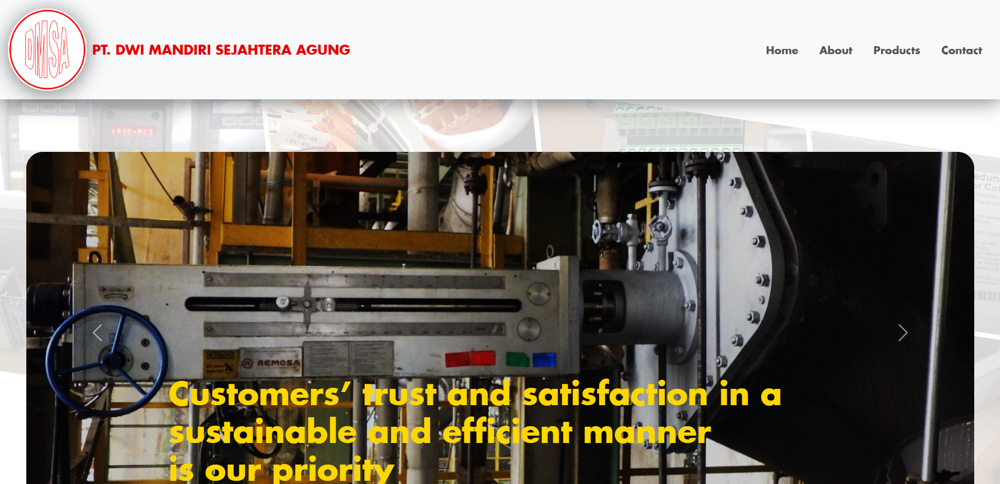
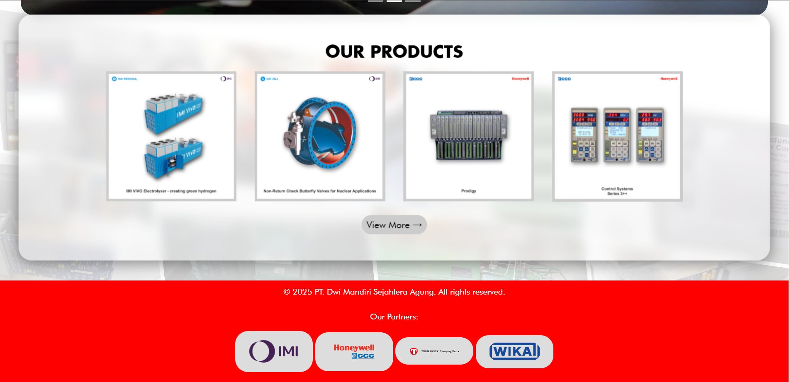
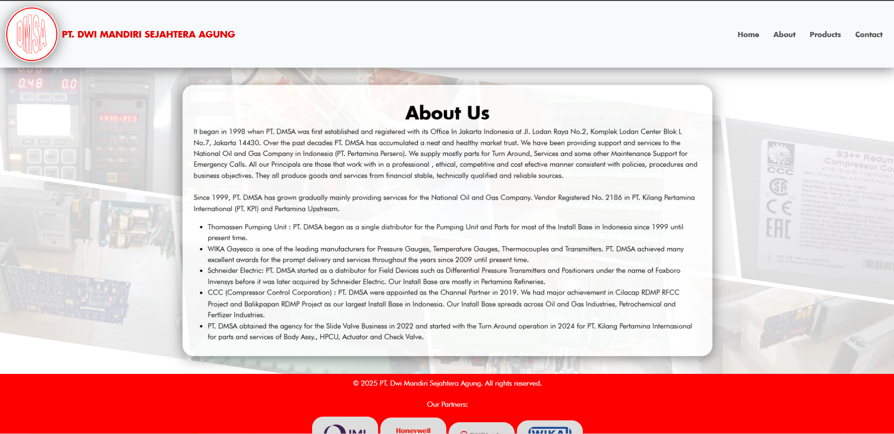
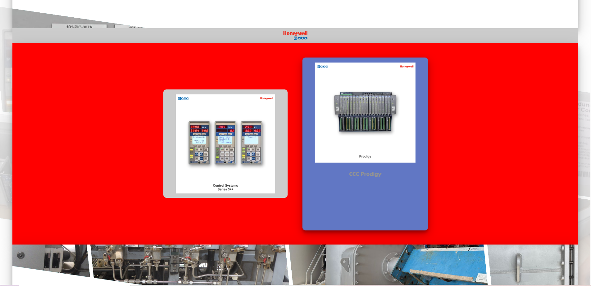

# PT. DMSA Company Profile

A Flask Powered Website showcasing company profile & products

## Table of Contents
- [Project Overview](#project-overview)
- [Tech Stack](#tech-stack)
- [Screenshots](#screenshots)
- [Demo link](#demo-link)
- [Roadmap](#roadmap)
- [Contributing](#contributing)
- [License](#license)

---

## Project Overview

This project demonstrates a small-scale landing page using the [Flask](https://flask.palletsprojects.com/) micro-framework for Python. It serves static pages and processes simple data on the server side, while using standard HTML and CSS for the front end. 

---

## Tech Stack

- **Flask (Python 3)** – Server-side framework
- **HTML5 & CSS3** – Client-side UI
- **Logging** - keeping website logs to console
- **VERCEL** - Deployment

---

## Folder Structure
- **app.py**: Contains all Flask routes and configuration.  
- **requirements.txt**: Lists all necessary Python packages (Flask, etc.).  
- **static/**: Holds all static files—CSS, JavaScript, images.  
- **templates/**: Where you store your HTML files that might use Jinja2 templating features.

## Screenshots

## Demo link
****

## Roadmap
1. **Front-end**
    - Enhancing user experience by implementing minimalist UI 
    - Improving visuals and readability by choosing the right image files
    - Improving animations
    - Improving mobile UI
    - adding videos and 3D overview of products

2. **Back-End**
    - Implementing user input in contacts to give notifications through emails

## Contributing
Currently, this repository is for demonstration purposes only. We are **not** accepting external contributions.

## License

All rights reserved. This repository is publicly visible for demonstration 
and reference purposes only. No reuse, modification, or distribution of 
this code is allowed without explicit permission.